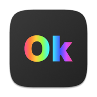

<!-- PROJECT LOGO -->
 

  

<h3 align="center">Ok Color Picker</h3>

  

    Pick colors using the Okhsv and Okhsl color spaces (based on Oklab).
     
    <a href="https://ok-color-picker.netlify.app/"><strong>Explore the app »</strong></a>
     
     
    <a href="https://github.com/holbrookdev/ok-color-picker/issues">Report Bug</a>
    ·
    <a href="https://github.com/holbrookdev/ok-color-picker/issues">Request Feature</a>
  

<!-- ABOUT THE PROJECT -->

## About The Project

[![Ok Color Picker Screen Shot][product-screenshot]](<[https://](https://ok-color-picker.netlify.app/)>)

### Built With

- [TypeScript](https://www.typescriptlang.org)
- [Vite](https://vitejs.dev)
  - [Vite Plugin PWA](https://vite-plugin-pwa.netlify.app/)
  - [vite-plugin-singlefile](https://github.com/richardtallent/vite-plugin-singlefile)

<!-- LICENSE -->

## License

Distributed under the MIT License. See `LICENSE` for more information.

<!-- ACKNOWLEDGMENTS -->

## Acknowledgments

- [Björn Ottosson](https://bottosson.github.io) (created Oklab, Okhsv, & Okhsl)

 

<small>Copyright &copy; 2022 Brian Holbrook</small>

(<a href="#top">back to top</a>)

<!-- MARKDOWN LINKS & IMAGES -->
<!-- https://www.markdownguide.org/basic-syntax/#reference-style-links -->

[product-screenshot]: .github/screenshot.png
